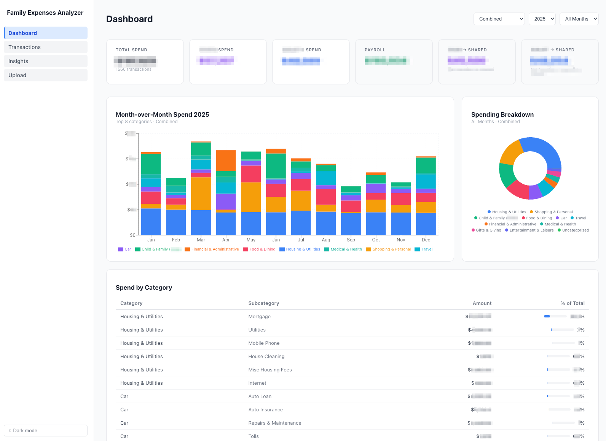
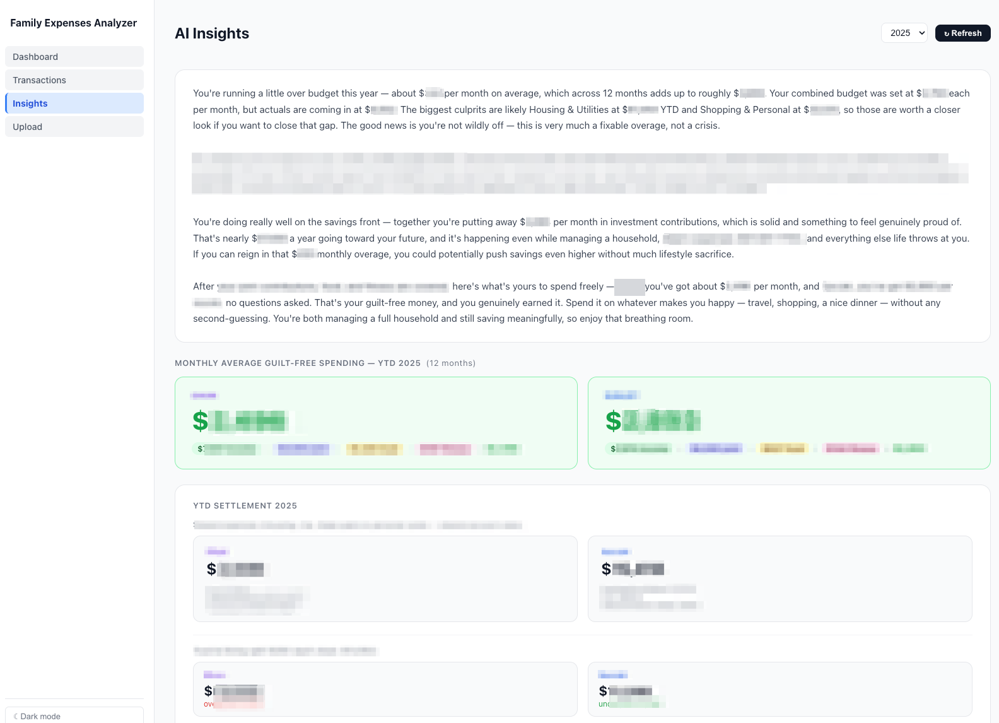
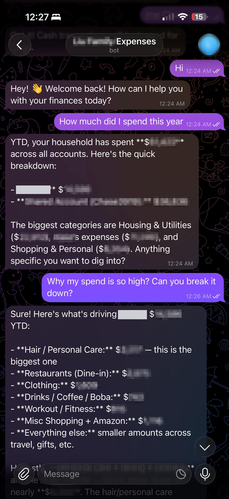

# BI Copilot for Household Finance

**An AI-powered BI stack for household finance** — built with [Claude Code](https://claude.com/claude-code). 

It consolidates statements from ~20 bank and credit card accounts into one warehouse, categorizes every transaction automatically, and puts the whole picture on a single dashboard. Claude Sonnet reads the aggregates and writes a plain-English financial narrative — and an always-on Telegram bot answers questions about the numbers from my phone.

<p align="center">
  
</p>

> **Figures in all screenshots are redacted.** This is a live system running on my household's real financial data, so the source code and database stay private. This repo is the case study: what I built, how it works, and why.

---

## Why I built it

Managing household expenses has always been a pain point for me. I tried the popular apps — Mint (RIP), Monarch Money — but nothing quite fit: either too rigid to customize for my family's specific needs, ongoing subscription fees, or I just didn't feel comfortable handing all my financial data to a third party.

So I built my own. It runs entirely on my own machine. The data never leaves it except for aggregate summaries sent to the Claude API, and the running cost is close to nothing.

The interesting part, to me, isn't that it's a budgeting app. It's that it's a full BI pipeline — ingestion, normalization, an entity-resolution layer, a warehouse, a semantic layer, and a natural-language interface on top.

---

## The three pillars

### 📊 A real dashboard, not a spending tracker

Summary cards across all accounts — per person and combined — with month-over-month stacked bars, a category donut, and a drill-down table by category and subcategory. Filter by year, month, and person. Every figure is computed from the transaction warehouse, not from a bank's own categorization.

### ✨ AI Insights — the narrative layer

A dashboard tells you *what* the numbers are; it doesn't tell you what they *mean*. The Insights page computes the structured financials server-side, then hands them to Claude Sonnet to answer four standing questions in plain English:

1. Are our expenses within budget?
2. How have shared expenses been split?
3. How much can we save each month?
4. What's our guilt-free spending?

**The math is deterministic; Claude only narrates.** Settlement balances, budget variances, and guilt-free calculations are all computed in Python and passed in as facts. The model's job is explanation and tone, never arithmetic — which is what makes the output trustworthy enough to act on.

<p align="center">
  
</p>

### 💬 Ask-Anything Bot — BI in my pocket

A Telegram bot backed by the same warehouse. Ask *"how much did we spend on dining last month?"* and get a real answer from live data — not a guess, not a stale cached report. Follow-ups work, because the bot keeps recent conversation context: *"why is that so high?"* resolves against the previous answer.

It also captures cash on the go. `log $15 coffee` parses the amount, infers the category, and writes a transaction that appears in the dashboard immediately. That closed the manual logging gap in our old spreadsheet process. 

<p align="center">
  
</p>

---

## How it works

```
  Bank / card statements (CSV + PDF)
              │
              ▼
  ┌───────────────────────┐
  │  Format detection     │   Routes each file to the right parser
  └───────────┬───────────┘
              ▼
  ┌───────────────────────┐   10 parsers — one per institution/format
  │  Parse & normalize    │   Unifies columns, dates, debit/credit direction
  │                       │   Applies exclusion rules, flags income
  └───────────┬───────────┘
              ▼
  ┌───────────────────────┐
  │  Deduplication        │   SHA-256 content hash per row
  └───────────┬───────────┘   Safe to re-import overlapping date ranges
              ▼
  ┌───────────────────────┐   Merchant-rule engine, ~910 rules
  │  Categorization       │◀──┐ 3-level fuzzy match, self-improving
  └───────────┬───────────┘   │
              ▼               │ every manual correction
  ┌───────────────────────┐   │ becomes a new rule
  │  SQLite warehouse     │───┘
  └───────────┬───────────┘
              │
      ┌───────┴────────┐
      ▼                ▼
  Dashboard      Aggregation layer ──▶ Claude Sonnet ──▶ Insights + Bot
```

Full technical write-up, including the normalization pipeline and design trade-offs: **[APPROACH.md](APPROACH.md)**

---

## Tech stack

| Layer | Technology |
|---|---|
| Frontend | React 19, TypeScript, Vite |
| Data fetching | TanStack React Query v5 |
| Charts | Recharts |
| Backend | FastAPI (Python) |
| ORM / warehouse | SQLAlchemy 2.0 + SQLite |
| PDF parsing | pdfplumber |
| AI | Anthropic Claude API (`claude-sonnet-4-6`) |
| Bot | python-telegram-bot |

---

## Repo contents

This is a **case study, not a distribution**. The application runs on my household's live financial data, so the source and database are private.

- `README.md` — this overview
- `APPROACH.md` — architecture, data pipeline, and design decisions
- `screenshots/` — dashboard, AI insights, and bot (figures redacted)
